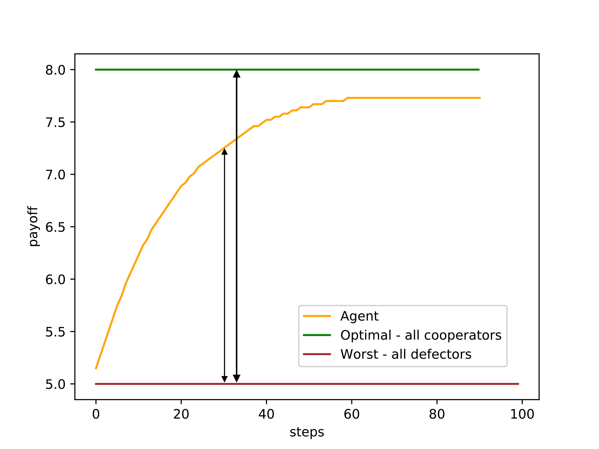
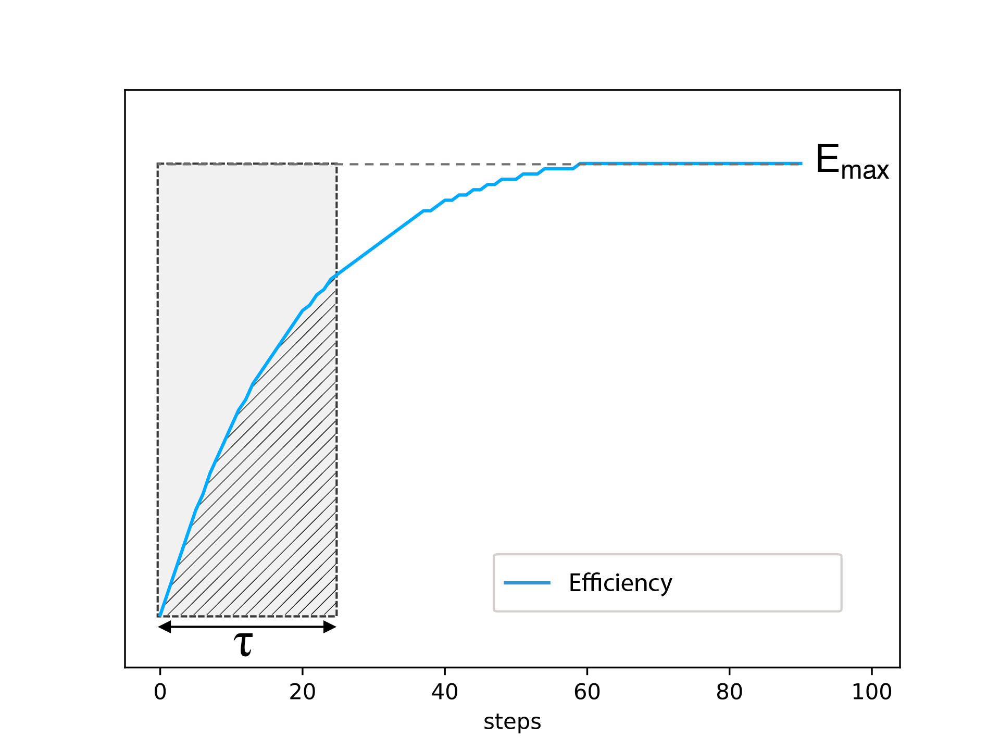
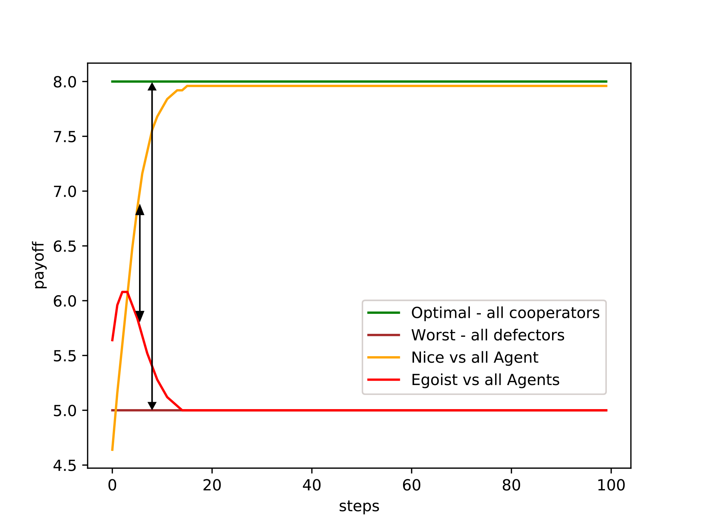
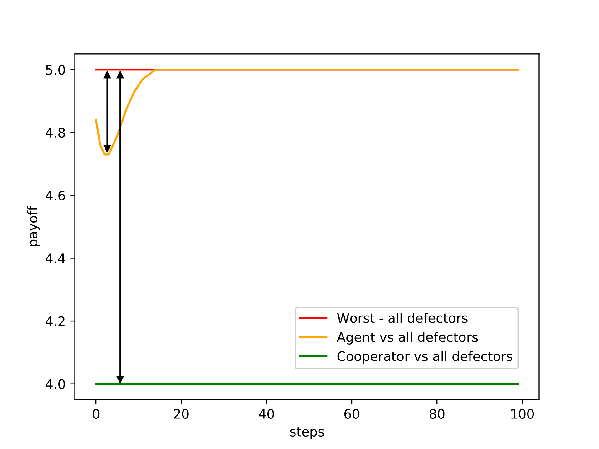
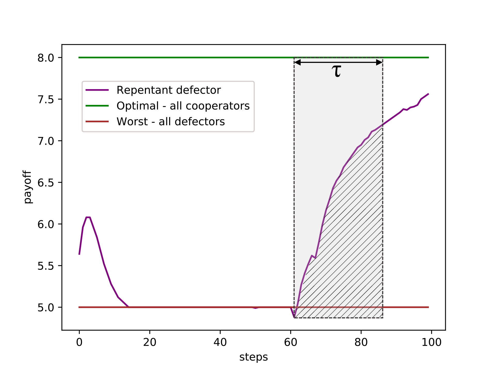

# Graph-based Iterated Prisoner's Dilemma

## Requirements:
- Python : requirements.txt
- Other : ffmpeg

## Lauching a tournament:
Some simulations with a video rendering can be made with the script `main_demo.py`.
It is possible to create a simulation (Customized simulation) or select one of the presets (Presets simulations).

### Customized simulation:
Select `choice_example = 0` and modify below:

A. Choose a tournament in the list by modifying `choice_tournament = `:
- circular 3 players
- full 3 players
- circular 4 players
- double circular 4 players
- circular 5 players
- double circular 5 players
- circular 6 players
- double circular 6 players
- tournament random 6 players 

B. Define agents with a list of keys by modifying `list_agents_keys = `:
- `T1`: a TFT without graph, TFT_alpha
- `T2`: a TFT without graph, TFT_beta
- `T3`: a TFT without graph, TFT_gamma
- `GT1`: a grTFT with Ford-Fulkerson approach and TFT_beta
- `GT2`: a grTFT with min-cost approach and TFT_beta
- `GT3`: a grTFT with min-cost approach and TFT_gamma
- `Tra1`: a Traitor who acts like GT3 during 30 steps and then defects, he cooperates again at t=60 (to study forgiveness)
- `Tra2`: a Traitor who acts like GT3 during 50 steps
- `Ln`: a Late Nice (or Repentant Defector), he defects during 25 steps, then cooperates
- `N`: Nice/Cooperator
- `D`: Egoist/Defector

### Presets simulations:
Select the index of example in `choice_example = `
Here are the proposed simulations:
1. 6 grTFT MinCost TFT_beta in a 6-players Double Circular Dilemma
2. 4 grTFT MinCost TFT_beta 
 and one Repentant Traitor (defects at t=30 and cooperates again at t = 60) 
 and one Traitor (defects after t=50) in a 6-players Double Circular Dilemma
3. The previous one (2) with TFT_gamma for the 4 grTFT
4. The simulation 3 with only 3 grTFT Mincost TFT_gamma in a 5-player Double Circular Dilemma
5. The simulation 3 with only 2 grTFT Mincost TFT_gamma in a 2-player Double Circular Dilemma
6. 2 grTFT Mincost TFT_beta and one Repentant Traitor in a 3-player Circular Dilemma
7. the previous simulation (6) with TFT_gamma for the two grTFT

## Evaluate an agent:
We propose in the script `main_evaluation.py` some examples of evaluation in which 5 metrics will be computed and a radar chart is created. In the script, 

1. Impact of the choice of graph processing, all with a continuous TFT_beta
- noGraph : the classic continuous TFT
- graph-based with Ford-Fulkerson algorithm 
- graph-based with Min-cost approach

2. Impact of the choice of TFT function (alpha / beta / gamma)
3. Impact of the beta coefficient with agent grTFT Beta mincost
4. Impact of the r0 with agent grTFT Beta mincost

## Details/Intuition for our metrics
### Efficiency

The efficiency is defined by the ratio of the differences indicated by the arrows.

### Speed

The speed is defined by the ratio of hatched area and the gray rectangle.

### Incentive-Compatibility 

The incentive compatibility is ratio of the differences indicated by the arrows.

### Safety

The safety is ratio of the differences indicated by the arrows.

### Forgiveness

The forgiveness is defined by the ratio of hatched area and the gray rectangle.
